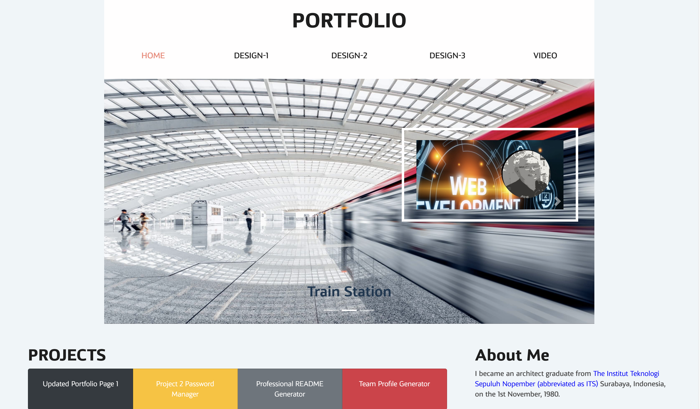

# Updated-Portfolio-Page-2

#  Professional-README-Generator
  

## Description

This Updated-Portfolio-Page-2, I have made an updated a lot of things. If you want to view my previous work you can click on **Updated Portfolio Page 1**, I display all my works, Password Generator, Code Quiz, Day Planner, Weather Dashboard, BCKS project and my graphic designs. In this Portfolio you can view Project 2 Password Manager, Professional README Generator, Team Profile Generator, Note Taker, Employee Tracker, E Commerce Backend and Tech Blog. I am using a combination of HTML, Css, Bootstrap 4, and Java Script to create my Update Portfolio Page 2. I have `index.html` as a homepage, `design1.html` as a Design Collection Template for House for Sale, `design2.html` and `design3.html` as a Design Collection Template for advertisement and `video.html` is a short video **Thank You for Watching**.  For the responsiveness in CSS I use `@media Query` and I used Bootstrap to make the image and video fully responsive. I created some image is black and white color, but when you touch it, will be back to normal color, I use class Greyscale, on css I created `.grayscale:hover {-webkit-filter: grayscale(0%); filter: grayscale(0%);}`. For all the icon I use vscode extention **React Icons**. I have difficulties to push my video to Github because the data is to big and I reduce it only 5,1 MB, but unfortunately still unsuccessful because the video I have deleted still in there. Eventually I install GitKraken to manage so I can delete my big data video and success. 

## Table of Contents (Optional)

- [Installation](#installation)
- [Usage](#usage)
- [Credits](#credits)
- [License](#license)
- [Badges](#badges)
- [Features](#features)
- [Contributing](#contributing)
- [Tests](#tests)
- [Questions](#questions)

## Installation

- I copy and paste from the official site Bootstrap to get Bootstrap 4.
- For the font I use Adobe font `font-family: kandin, sans-serif`;

## Usage

- From the navbar homepage you can click Desing1, Design2, Design3 and Video and will go to the page 2,3 & 4. But if you using mobile phone, you have to click menu to get them.
- When you visit the page, you have option to go back, go foward or back to the homepage, there are buttons on the bottom of the page.
- Under Projects are my latest works, you can click Updated Portfolio Page 1, Project 2 Password Manager, Professional README Generator, Team Profile Generator, Note Taker, Employee Tracker, E Commerce Backend & Tech Blog and go to the link's destination.
- If you want to view my previous work, you can click on Updated Portfolio Page 1.
- Under About Me you can click the blue text and go the link's detination.
- You can contact Me use Email or Linkedin and visit my github, all will go the the link's destination

## Demo

- Link demo page: [github](https://b-smd.github.io/Updated-Portfolio-Page-2/)

## Credits

- [Simon-Xu-Lan](https://github.com/Simon-Xu-Lan)
- [Sam-Ngu](https://github.com/sam-ngu)

## License
    This application is covered by the MIT license.

---
## Badges

## Features

n/a

## Contributing

Pull request are welcome, you can make a constribution at the bottom of any docs page to make small changes such as a typo, sentence fix or a broken link. For major changes, please open an issue first to discuss what you would like to change.

## Tests

n/a

## Questions

If you have any question, [Email-me](djaja@iinet.net.au) 

Find me on GitHub: [B-smd](https://github.com/B-smd)   

